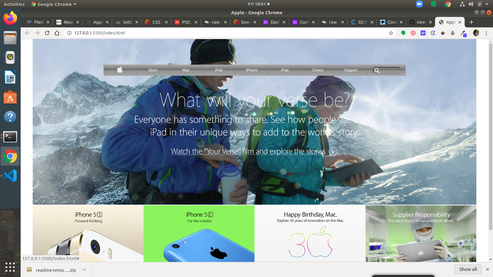

# Apple Archive page clone

> This project consists of building a webpage using images as a background and adding gradients to elements.

The goal is to make a clone of old an old version of the Apple website webpage.

## Built With

- HTML5, CSS3

## Live Demo

[Live Demo Link](https://raw.githack.com/ezeilo-su/apple-page-clone/work/index.html)

## Authors

👤 **Author1**

- Github: [@githubhandle](https://github.com/githubhandle)
- Twitter: [@twitterhandle](https://twitter.com/sundayezeilo)
- Linkedin: [linkedin](https://www.linkedin.com/in/sunday-ezeilo-a6a67664/)

## 🤝 Contributing

Contributions, issues and feature requests are welcome!

Feel free to check the [issues page](issues/1).

## Show your support

Give a ⭐️ if you like this project!
